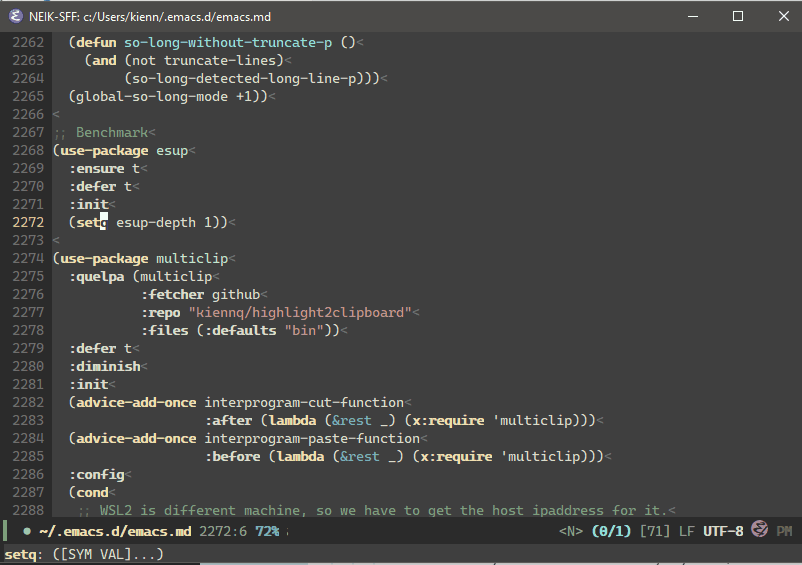

# multiclip - Copy text to clipboard with highlighting

This is my fork of [highlight2clipboard](https://github.com/Lindydancer/highlight2clipboard) that works with delay rendering and
completely override `Emacs` system clipboard.

*Author:* Anders Lindgren<br>
*Version:* 0.5<br>

Support for copying text with formatting information, like color, to the system
clipboard.  Concretely, this allows you to paste syntax highlighted source code
into word processors and mail editors.
Also, this package acts as clipboard provider, completely short-circut `Emacs`'s
system clipboard call.

### Demo


### Installation

Since this is a fork, the recommended method is to using [`Quelpa`](https://github.com/quelpa/quelpa).

A simple configuration that also make it works cross machine between WSL2 and
Windows.

``` emacs-lisp
(use-package multiclip
  :quelpa (multiclip
           :fetcher github
           :repo "kiennq/highlight2clipboard"
           :files (:defaults "bin"))
  :diminish
  :config
  (cond
   ;; WSL2 is different machine, so we have to get the host ipaddress for it.
   ((executable-find "wslpath")
    (setq multiclip-host
          (substring (shell-command-to-string "ip r l default | cut -d\\  -f3")
                     0 -1))))
  (multiclip-mode +1))
```

### Usage:

* <kbd>M-x multiclip-copy-region-to-clipboard RET</kbd> -- Copy the region, with
  formatting, to the clipboard.
* <kbd>M-x multiclip-copy-buffer-to-clipboard RET</kbd> -- Copy the buffer, with
  formatting, to the clipboard.
* multiclip mode -- Global minor mode, when enabled, all copies and cuts are
  exported, with formatting information, to the clipboard.

### Supported systems

Copying formatted text to the clipboard is highly system specific.  Currently,
MS-Windows and WSL (interopable) are supported.  Contributions for other systems
are most welcome.

### Known problems

Font Lock mode, the system providing syntax highlighting in Emacs, use "lazy
highlighting".  Effectively, this mean that only the visible parts of a buffer
are highlighted.  The problem with this is that when copying text to the
clipboard, only the highlighted parts gets formatting information.  To get
around this, walk through the buffer, use
`multiclip-ensure-buffer-is-fontified`, or use one of the `multiclip-copy-`
functions.

### Implementation

This package use the package `htmlize` to create an HTML version of a
highlighted text.  This is added as a new flavor to the clipboard, allowing an
application to pick the most suited version.  Additional to that, clipboard's
changes are now monitored and will be reflect to `Emacs` before hand, clipboard
delay rendering also supported.  Copy & Paste and be pleasingly fast.
